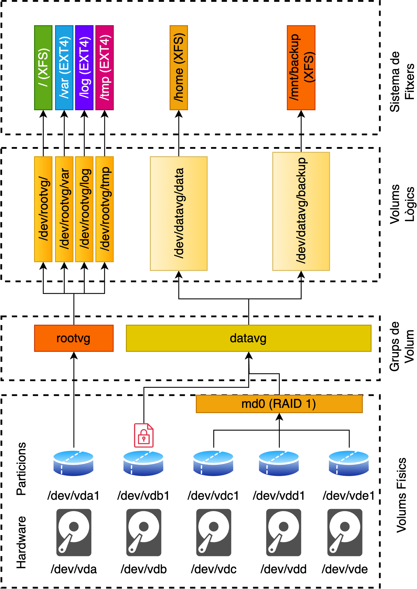

# LVM

**LVM** (Logical Volume Manager) és un sistema de gestió de volums lògics que ofereix diverses avantatges significatives en l'administració del disc dur en sistemes Unix i Linux.

## Avantatges

- **Flexibilitat**: LVM permet als administradors gestionar l'espai en disc de manera més flexible i dinàmica. És possible crear particions virtuals (volums lògics) a partir de particions físiques (volums físics) i ajustar-les a mida que les necessitats canvien.

- **Elasticitat**: Capacitat d'estendre i reduir volums lògics en temps real sense haver de reformatar el sistema de fitxers o realitzar canvis importants en la configuració. Això permet una adaptació més ràpida a les necessitats de l'emmagatzematge sense interrompre les operacions.

- **Snapshots**: Permet crear snapshots, que són instantànies puntuals d'un volum lògic en un moment determinat. Això és útil per realitzar còpies de seguretat sense interrompre les operacions en curs. Els snapshots poden ser utilitzats per a la restauració de dades o per a la creació de rèpliques.

- **Mirroring**: Permet tenir una còpia idèntica d'un volum lògic en dos discs durs diferents. Aquesta funció proporciona redundància i alta disponibilitat en cas de fallades de disc, assegurant que les dades siguin accessibles en tot moment.

- **Escalabilitat**: Permet agrupar diversos discs en un sol espai de gestió, cosa que facilita la gestió de múltiples dispositius d'emmagatzematge com si fossin un únic recurs.

## Exemple

- Suposem que tenim un disc dur amb *4 particions contigües*. En el futur, si volguessim augmentar una de les 3 primeres particions, hauríem de borrar les que hi ha després, la qual cosa és complexa, perillosa i gairebé segurament requeriria que aturéssim el servei.

- Suposem que volguessim ampliar l'última partició, sempre tindríem el límit de la mida del disc. 

- Ara imaginem que comprem un disc nou i volem ampliar l'espai d'un sistema de fitxers existent al disc anterior amb l'espai nou. Totes aquestes limitacions són reals en un sistema sense LVM.

Amb LVM, totes aquestes limitacions desapareixen. Podem augmentar les seves particions (anomenades volumes lògics) independentment de si hi ha espai lliure contigu a aquestes. Podem augmentar els nostres volums lògics utilitzant espai lliure de diferents discs físics. Podem moure volums lògics entre dispositius físics. Sense desmuntar el sistema de fitxers, sense aturar un servei.

## Components

Els volums físics (**PV**) poden ser qualsevol dispositiu de bloc, com ara un disc dur, una partició, un dispositiu RAID o un dispositiu xifrat. Habitualment, els volums físics es poden utilitzar sense formatar-los.

Els grups de volums (**VG**) són un conjunt de volums físics i són el nivell de gestió més alt en LVM. Els grups de volums es poden ampliar afegint-hi volums físics i es poden reduir eliminant-los. Els grups de volums es poden crear amb un sol volum físic i es poden ampliar a mesura que es necessiti més espai.

Els volums lògics (**LV**) són particions virtuals que es poden crear a partir d'un grup de volums. Els volums lògics es poden ampliar afegint-hi espai del grup de volums i es poden reduir eliminant espai del volum lògic. L'administrador pot decidir quin (PV) alimenta un (LV) i quina mida té el (LV).

## Escenari Real: Gestió de Volums LVM en un Entorn Real

### Configuració Inicial

- **Disc 1 (/dev/vda1)**: Aquest disc és destinat per configurar el **VG** per gestionar el sistema.**Recordeu**: és important garantir que el sistema operatiu tingui prou espai sense cap limitació.
Aquest *VG* s'utilitza per donar servei als *LVs* següents: /dev/mapper/rootvg-root, /dev/mapper/rootvg-log, /dev/mapper/rootvg-tmp, /dev/mapper/rootvg-var.
  
- **Discs 2 a 5 (/dev/vdb1, /dev/vdc1, /dev/vdd1, /dev/vde1)**: Aquests discs es poden utilitzar de manera flexible. Poden ser encriptats o formar una RAID per crear el **VG** *datavg*, que gestionarà les dades del sistema. Aquest *VG* s'utilitza per donar servei als *LVs* següents: /dev/mapper/datavg-home, /dev/mapper/datavg-backups.



### Manca d'Espai en un LV

Imaginem que, amb el temps, el **LV (/dev/rootvg/log)** que emmagatzema els logs del sistema es queda sense espai. Aquesta situació podria ser crítica per al sistema, ja que no voldríem perdre informació de logs important.

Amb LVM, l'administrador pot prendre mesures immediates per solucionar el problema sense aturar el sistema. Pot ampliar el **LV (/dev/rootvg/log)** amb l'espai lliure del **VG (/dev/rootvg)**, la qual cosa amplia el sistema de fitxers (/dev/mapper/rootvg-log) sense haver de desmuntar-lo. Això té una implicació important per a la disponibilitat del sistema, ja que no es requereixen aturades.

> Però i si **/dev/rootvg** està ple? En aquest escenari, l'administrador no ha de preocupar-se, ja que pot adquirir un disc nou i afegir-lo al **VG (/dev/rootvg)** en qualsevol moment per ampliar el **LV (/dev/rootvg/log)**. Això permet mantenir el sistema en funcionament i adaptar-se a les creixents necessitats d'emmagatzematge.

### Escalabilitat del Hardware

Ara imaginem que tenim el VG **(/dev/datavg)** inicialment únicament disposa d'un disc (**vdb**) i tenim un LV (**/dev/mapper/datavg-backups**) que emmagatzema les còpies de seguretat del sistema i ocupa 20GB. Més endavant, afegim al sistema 3 discs (**vdc,vdd,cde**) formant la RAID (**md0**). LVM ens permet moure en calent els 20GB del LV (**/dev/mapper/datavg-backups**) del disc (**vdb**) a la RAID (**md0**), tot de manera transparent al sistema de fitxers i les aplicacions que el fan servir. Això ens permet millorar el hardware del servidor sense haver de recrear sistemes de fitxers, copiar dades i canviar punts de muntatge.

## Recomanació

Tenir espai lliure en el **VG** per poder ampliar els **LV** quan sigui necessari. Aner afegint discs a la màquina i afegir-los al **VG** que automaticament es tindrà més espai lliure per poder ampliar els **LV**.

## Comparació amb altres sistemes

En aquest punt, ja heu pogut observar les principals avantatges de LVM i com ens ajuden a superar les limitacions dels sistemes de gestió de disc tradicionals (com les particions). Les RAID són un bon complement a LVM per una gestió més granular i no té sentit una comparació estricta ja que es poden utilitzar conjuntament.

**ZFS** és molt similar a **LVM**. Ambdós són sistemes de gestió de volums lògics que permeten crear particions virtuals a partir de particions físiques. La principal diferència és que ZFS combina un sistema de fitxers i una capa de volum de disc en un mateix sistema, mentre que LVM es centra en la gestió de volums lògics. **ZFS** ofereix funcions de seguretat i protecció de dades més avançades. Per tant, a la pràctica, **LVM** permet ser més modular i s'utilitza sovint en conjunció amb sistemes de fitxers com *ext4 o XFS*. Jo us recomanari utilitzar **LVM** ja que és més flexible i permet utilitzar qualsevol sistema de fitxers. Ara bé, utilitzaria **ZFS** en sistemes on la seguretat i la protecció de dades siguin crítiques.

Per exemple, per un servidor de backups us aconsellaria utilitzar **ZFS**. En canvi, per un servidor de bases de dades o web, utilitzaria **LVM** per la seva flexibilitat i modularitat.

## Exercicis pràctics

### Creació de PV, VG i LV

1. Assegureu-vos de tenir el paquet **lvm2** instal·lat.

    ```sh
    dnf install lvm2 -y
    ```

2. Ara crearem un volum físic (**PV**) a partir del disc **/dev/vdb**.

    ```sh
    pvcreate /dev/vdb
    ```

    > **Observació**: Assegureu-vos que el disc no està en ús abans de crear el **PV**. I elimineu  les particions que pugui tenir, per exemple amb ```mkfs.xfs -f /dev/vdb```.

3. Podeu utilitzar ```pvdisplay``` per veure la informació del **PV** creat.

    ```sh
    pvdisplay
    ```

4. Ara crearem un grup de volums (**VG**) anomenat **datavg** a partir del **PV** creat anteriorment.

    ```sh
    vgcreate datavg /dev/vdb
    ```

5. Podeu utilitzar ```vgdisplay``` per veure la informació del **VG** creat.

    ```sh
    vgdisplay
    ```

6. Ara crearem un volum lògic (**LV**) anomenat **home** a partir del **VG** creat anteriorment. Aquest **LV** tindrà una mida de **20MB**. On *-L* indica la mida i *-n* el nom.

    ```sh
    lvcreate -L 20MB -n home datavg
    ```

7. Podem utilitzar ```lvdisplay``` per veure la informació del **LV** creat.

    ```sh
    lvdisplay
    ```

8. Ara crearem un sistema de fitxers **XFS** al **LV** creat anteriorment.

    ```sh
    mkfs.xfs /dev/datavg/home
    ```

9. Ara ja podeu montar el **LV** creat anteriorment al directori **/mnt/home**.

    ```sh
    mkdir /mnt/home
    mount /dev/datavg/home /mnt/home
    ```

### Ampliació de LVs

Imagineu la situació que el **LV** creat anteriorment (**/dev/datavg/home**) s'ha quedat sense espai. Però, l'administrador té espai lliure al **VG** (**datavg**). En aquest cas, l'administrador pot ampliar el **LV** amb l'espai lliure del **VG**.

1. Ara ampliarem el **LV** creat anteriorment (**/dev/datavg/home**) amb 10MB més.

    ```sh
    lvextend -L +10MB /dev/datavg/home
    ```

2. Comprovem que el **LV** s'ha ampliat.

    ```sh
    lvdisplay
    ```

    > **Nota**: En aquest punt heu ampliat el **LV** però el sistema de fitxers **XFS** no té accés a l'espai nou. Per tant, el sistema de fitxers **XFS** no pot utilitzar l'espai nou. Per això, el sistema de fitxers **XFS** no mostra l'espai nou. ```df -h```.

3. Ara necessitem ampliar el sistema de fitxers **XFS** perquè pugui utilitzar l'espai nou.

    ```sh
    xfs_growfs /dev/datavg/home
    ```

    > **Nota**: En aquest punt heu ampliat el **LV** i el sistema de fitxers **XFS** té accés a l'espai nou. Per tant, el sistema de fitxers **XFS** mostra l'espai nou. ```df -h```.

També pot passar la situació contraria, que el **LV** tingui espai lliure i el **VG** no. En aquest cas, l'administrador pot reduir el **LV** per alliberar espai al **VG**. Aquesta és una pràctica que cal evitar, ja que pot provocar la pèrdua de dades. Es millor anar assignant espai raonables als **LVs** ja que es poden ampliar facilment. En canvi, reduir un **LV** pot ser perillós.

1. Ara reduirem el **LV** creat anteriorment (**/dev/datavg/home**) amb 10MB.

    ```sh
    lvreduce -L -10MB /dev/datavg/home
    ```

    > **Nota**: Sempre us demanarà confirmació abans de reduir el **LV**, ja que pot ser perillós i pot provocar la pèrdua de dades.

2. Comprovem que el **LV** s'ha reduït.

    ```sh
    lvdisplay
    ```

3. Ara necessitem reduir el sistema de fitxers **XFS** perquè pugui utilitzar l'espai nou.

    ```sh
    xfs_growfs /dev/datavg/home
    ```

    > **Nota**: En aquest punt heu reduït el **LV** i el sistema de fitxers **XFS** té accés a l'espai nou. Per tant, el sistema de fitxers **XFS** mostra l'espai nou. ```df -h```.

### Creació de Snapshots

Els snapshots són instantànies puntuals d'un volum lògic en un moment determinat. Això és útil per realitzar còpies de seguretat sense interrompre les operacions en curs. Els snapshots poden ser utilitzats per a la restauració de dades o per a la creació de rèpliques.

1. Ara crearem una serie de carpetes i documents a **/mnt/home**:

    ```sh
    mkdir /mnt/home/folder1
    mkdir /mnt/home/folder2
    mkdir /mnt/home/folder3
    touch /mnt/home/folder1/file1.txt
    touch /mnt/home/folder2/file2.txt
    touch /mnt/home/folder3/file3.txt
    ```

2. Ara crearem un snapshot del **LV** creat anteriorment (**/dev/datavg/home**).

    ```sh
    lvcreate -L 10MB -s -n home-snap /dev/datavg/home
    ```

3. Malhauradament heu eliminat el folder3 i el seu contingut. Però, gràcies al snapshot, podeu recuperar el seu contingut.

    ```sh
    rm -rf /mnt/home/folder3
    ls /mnt/home
    ```

4. Ara restaurem el snapshot.

    ```sh
    umount /mnt/home
    lvconvert --merge /dev/datavg/home-snap
    mount /dev/datavg/home /mnt/home
    ls /mnt/home
    ```

### Moviments entre PVs

Imagineu que ara montem un disc nou (**/dev/vdc**) i volem moure el **LV** (**/dev/datavg/home**) al nou disc. Això és possible amb LVM.

1. Ara crearem un **PV** a partir del disc nou (**/dev/vdc**).

    ```sh
    pvcreate /dev/vdc
    ```

2. Ara afegirem el **PV** al **VG** (**datavg**).

    ```sh
    vgextend datavg /dev/vdc
    ```

3. Ara mourem el **LV** (**/dev/datavg/home**) al nou **PV** (**/dev/vdc**).

    ```sh
    pvmove /dev/vdb /dev/vdc
    ```

### Creació de Mirroring

Els mirroring són una còpia idèntica d'un volum lògic en dos discs durs diferents. Aquesta funció proporciona redundància i alta disponibilitat en cas de fallades de disc, assegurant que les dades siguin accessibles en tot moment.

Assumirem que tenim 2 discs (**/dev/vdb** i **/dev/vdc**) i volem crear un **LV** (**/dev/datavg/home-mirror**) amb mirroring.

1. Ara crearem un **LV** (**/dev/datavg/home-mirror**) amb mirroring a partir del **LV** (**/dev/datavg/home**).

    ```sh
    lvcreate -m1 -L 20MB -n home-mirror datavg
    ```

2. Ara crearem un sistema de fitxers **XFS** al **LV** creat anteriorment.

    ```sh
    mkfs.xfs /dev/datavg/home-mirror
    ```

3. Ara ja podeu montar el **LV** creat anteriorment al directori **/mnt/home-mirror**.

    ```sh
    mkdir /mnt/home-mirror
    mount /dev/datavg/home-mirror /mnt/home-mirror
    ```

4. Ara podem comprovar que el **LV** (**/dev/datavg/home-mirror**) té mirroring.

    ```sh
    lvs -a -o +devices
    ```

5. Ara podeu afegir informació al **LV** (**/dev/datavg/home**) i comprovar que es replica al **LV** (**/dev/datavg/home-mirror**) de forma automàtica.

    ```sh
    touch /mnt/home/file.txt
    ls /mnt/home-mirror
    ```

6. Per observar les avantatges del mirroring podem fer un experiment molt simple. Ara assumirem que el disc **/dev/vdb** falla. Per simular-ho, desactivarem el disc.

    ```sh
    pvchange -x n /dev/vdb
    ```

7. Ara comprovarem que el **LV** (**/dev/datavg/home-mirror**) segueix funcionant.

    ```sh
    ls /mnt/home-mirror
    ```

Aquest exercici il·lustra com el mirroring garanteix la disponibilitat de les dades en cas de fallades de disc i com es poden realitzar operacions de manteniment sense pèrdua de dades.

Per finalitzar podem eliminar i netejar el sistema.

1. Desmontem els sistemes de fitxers:

    ```sh
    umount /mnt/home
    umount /mnt/home-mirror
    ```

2. Eliminem l'snapshot:
   
   ```sh
   lvconvert --merge /dev/datavg/home-snap
   ```

3. Elimina els volums lògics:

   ```sh
   lvremove /dev/datavg/home
   lvremove /dev/datavg/home-mirror
   ```

4. Elimina els grups:

    ```sh
    vgremove datavg
    ```

5. Elimina els volums físics:

    ```sh
    pvremove /dev/vdb
    pvremove /dev/vdc
    ```